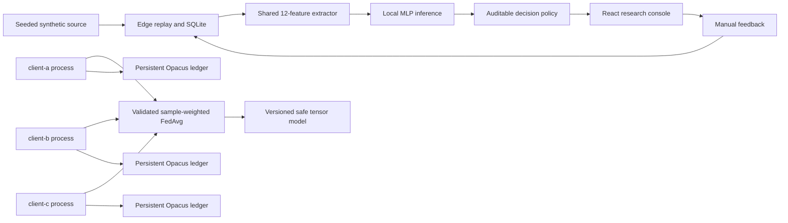

# Architecture

Each client worker reads only its assigned five-subject synthetic partition. The experiment coordinator supplies identical safe-tensor weights, launches three separate Python processes, validates parameter keys/shapes/dtypes/finite values, and computes sample-weighted FedAvg. The browser reads edge history and aggregate experiment manifests from loopback APIs.
